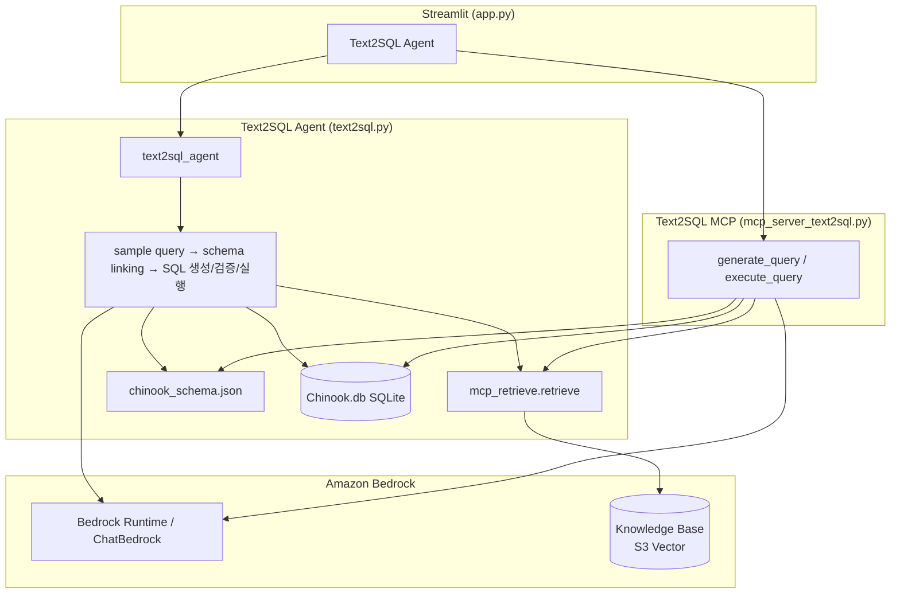

# MCP로 Tex2SQL 활용하기

여기에서는 AI 애플리에키션이 데이터베이스를 조회하기 위해 사용하는 Text2SQL을 구현하는 방법에 대해 설명합니다. 전체적인 architecture는 아래와 같습니다. Local PC에 설치된 streamlit을 이용해 미리 생성한 example query(json 파일)을 업로드하면, Knowledge Base가 sync를 통해, Amazon S3 Vector에 embedding된 vector가 저장됩니다. 이후, 사용자가 streamlit의 채팅창에서 질문을 하면 text2sql tool은 먼저 Knowledge Base를 조회하여 example query들을 가져온 후에 데이터베이스의 schema를 참조하여 SQL 문을 생성한 후에 database를 조회합니다. 생성된 SQL에 대한 근거문서인 example query는 CloudFront - S3 형태로 확인할 수 있습니다. 또한 example query문은 chunk 길이가 다른 RAG 문서에 비해 작으므로, 비용면에서 우수한 Amazon S3 vector를 이용해 Knowledge Base의 지식 저장소로 Amazon S3 Vector를 이용합니다.


Text2SQL을 위해서는 [chinook_schema.json](./labs/chinook_schema.json)와 같은 schema 정보가 필요합니다. 이는 데이터베이스 관리자가 기존에 관리하던 schema 정보를 활용하여 작성하여야 하며, 만약 LLM을 이용해 신규로 작성한다면 담당자 확인을 통해 정확한 정보가 반영되도록 하여야 합니다. 이후 Text2SQL의 정확도를 높이기 위해 example query문을 생성합니다. 이 example query는 기존에 활용하거나 성공한 SQL문과 용도를 json형태로 정리한것으로서, schema 문서에 있는 table, column정보와 함께 SQL문 생성의 정확도에 중요한 역할을 합니다. 이와같이 agent는 사용자의 질문에 답하기 위해 데이터베이스 조회가 필요하다고 생각이 되면 text2sql 도구를 통해 RAG로 부터 example query문을 검색하고 schema 정보를 함께 활용하여, 적절한 SQL문을 생성하여 데이터베이스를 조회하게 됩니다. 

## Operation Architecture



| 모드 | 모듈 | 설명 |
|------|------|------|
| 일상적인 대화 | `chat.general_conversation` | 대화 이력 + Bedrock Runtime `invoke_model_with_response_stream` 스트리밍 |
| RAG | `chat.run_rag_with_knowledge_base` | Bedrock Knowledge Base 검색(`retrieve`) 후 Bedrock Runtime으로 답변 생성 |
| **Agent** | `langgraph_agent.run_langgraph_agent` | LangGraph + MCP + Skills (채팅 히스토리 비활성) |
| **Agent (Chat)** | `langgraph_agent.run_langgraph_agent` | LangGraph + MCP + Skills + LangGraph checkpointer로 대화 이력 유지 |
| **Text2SQL Agent** | `text2sql.text2sql_agent` | KB에서 example query 검색 → schema linking → SQL 생성/검증/실행 → 자연어 답변 |
| 번역하기 | `chat.translate_text` | 한국어 ↔ 영어 번역 |
| 이미지 분석 | `chat.summarize_image` | ChatBedrock 멀티모달 (이미지 + 텍스트) 분석 |


## Schema Linking

Text-to-SQL 분야에서 핵심적인 단계 중 하나로, 자연어 질문(Natural Language Question)에 등장하는 단어나 표현을 데이터베이스의 스키마 요소(테이블명, 컬럼명, 값 등)와 연결(매핑)하는 과정입니다. 자연어에는 모호한 표현이 많기 때문에, 어떤 테이블/컬럼을 가리키는지 정확히 파악해야 올바른 SQL을 생성할 수 있습니다. Schema Linking이 잘못되면 엉뚱한 테이블이나 컬럼을 참조하는 SQL이 만들어져 결과가 틀리게 됩니다. 여기에서는 [Lab. 1-1 Schema Preparation-1](https://github.com/aws-samples/aws-ai-ml-workshop-kr/blob/master/genai/aws-gen-ai-kr/20_applications/12_advanced_agentic_text2sql/lab1_text2sql_schema_preparation/1.sample_queries.ipynb)을 참조하였습니다.

Schema linking은 아래와 같은 방법을 통해 구현합니다.

- 문자열 매칭 - 질문의 단어와 스키마 이름을 직접 비교
- 임베딩 유사도 - 단어의 의미적 유사도를 벡터로 비교
- LLM 활용 - GPT 등 대형 언어 모델이 문맥을 파악하여 자동으로 연결

복잡한 데이터베이스에서 Text2SQL을 할때에 가장 어려운 작업은 쿼리 생성에 필요한 스키마를 선별하는 과정, 즉 Schema Linking 입니다. 대부분의 기업 환경에서는 table/column 이름이 의미를 축약하고 있어서 LLM이 이를 파악하기 힘들거나, table/colmn이 너무 많아서 모든 목록을 프롬프트에 담아 전달하는 것이 불가능한 경우가 많습니다. 이를 해결하기 위해, 데이터베이스에 맞춰 스키마 설명 문서를 정제하고, LLM에 필요한 컨텍스트를 선별하여 제공하는 작업이 필요합니다. 

### Step 1: Schema Description 문서 

[chinook_schema.json](./labs/chinook_schema.json)와 같은 schema를 설명한 문서를 읽어옵니다. 아래는 정의된 schema의 일부분입니다. Schema description 문서에는 테이블의 이름과 테이블에 대한 기본 설명, 컬럼 이름과 컬럼에 대한 설명이 포함되어야 합니다. 

```java
{
    "table_name": {
        "table_desc": "Description of the table",
        "cols": [
            {
                "col": "Column Name 1",
                "col_desc": "Description of the column including PK info"
            },
            {
                "col": "Column Name 2",
                "col_desc": "Description of the column"
            }
        ]
    }
}
```

정리된 schema 설명 문서가 없다면, LLM을 이용해 초안을 작성한 후에 담당자를 통해 수정하는 절차를 진행합니다.


### Step 2: SQL2Text 샘플 쿼리 변환 

LLM이 SQL문을 잘 이해할수 있도록 schema linking을 수행합니다. 이를 위해 여기에서는 기존 성공한 query문에 대해 자연어 설명을 생성합니다. 이후 자주 사용하는 query문들은 정기적으로 자연어 질문으로 변환하여 추가합니다. 

쿼리를 해석하기 위해서 각 쿼리에 사용된 테이블/컬럼의 의미를 파악해야 합니다. 따라서, [chinook_sample_queries.sql](./labs/chinook_sample_queries.sql)와 같은 schema 문서를 활용하여, 각 query문에 사용된 테이블/컬럼 정보를 아래와 같이 추출합니다.
```
{
  "table": ["table1", "table2", ...],
  "column": ["col1", "col2", ...]
}
```

"SELECT CustomerId, SUM(Total) AS TotalPurchase FROM Invoice GROUP BY CustomerId ORDER BY TotalPurchase DESC LIMIT 5"와 같은 query문이 있다면, 아래와 같이 table/column에 대한 정보를 추출합니다. 

```python
def extract_schema(query):
    chat = ChatBedrock(model_id=modelId, region_name='us-west-2', model_kwargs=model_kwargs)

    system = """ 
You are an expert in extracting table names and column names from SQL queries. 
From the provided SQL query, extract all table names and column names used for SELECT, WHERE, and JOIN clauses, excluding asterisks ("*"). 
Ensure that the response is in a valid JSON format that can be used directly with json.load(). 
Skip the preamble and only provide the answer in a JSON document:

{{
  "table": ["table1", "table2", ...],
  "column": ["col1", "col2", ...]
}}

<example>
SQL:
SELECT * from LOGIS_ADMIN.IAWD_TB_DCBSCD_BASISLC_M 
where basis_lclsf_cd_nm like '%예약구분%'
LIMIT 200;

{{
  "table": ["IAWD_TB_DCBSCD_BASISLC_M"],
  "column": ["basis_lclsf_cd_nm"]
}}
</example>
"""
    human = "SQL: {sql}"

    prompt = ChatPromptTemplate.from_messages([("system", system), ("human", human)])

    chain = prompt | chat | StrOutputParser()

    response = chain.invoke({"sql": query})

    used_schema = parse_json_response(response)
    print(used_schema)

    return used_schema
```

이때 추출된 table, column 정보는 아래와 같습니다.

```java
{
  "table": ["Invoice"],
  "column": ["CustomerId", "Total", "TotalPurchase"]
}
```

이제 [chinook_schema.json](./labs/chinook_schema.json)에서 table과 column에 대한 description을 추출합니다.

```python
schema_description = load_schema_description()
extracted_description = extract_descriptions(
    schema_description, used_schema['table'], used_schema['column']
)
```

이때의 결과는 아래와 같습니다.

```python
{
  "table": {
    "Invoice": "Records details of transactions, linked to customers."
  },
  "column": {
    "CustomerId": "Foreign key that references the customer associated with this invoice.",
    "Total": "Total amount of the invoice."
  }
}
```

이후, 아래와 같이 query문 의미를 하나의 문장으로 정리합니다.

```python
def translate_query(query, description):
    chat = ChatBedrock(model_id=modelId, region_name='us-west-2', model_kwargs=model_kwargs)

    system = """
You are an SQL expert who understands the intent behind a given SQL query.
Translate the SQL query into one short Korean sentence that a real user might say.

- Output exactly one sentence (under 80 Korean characters when possible).
- Include all filters, joins, aggregations, ordering, and limits from the SQL.
- Do not reference the <description> section; do not use a question form.
- Use a concise, straightforward tone without a verb ending (e.g. "~조회", "~확인").
- Do not add headings, bullet lists, markdown, or business-purpose explanations.
- Return only the sentence, with no preamble or labels.
"""
    human = """
<description>
{description}
</description>

SQL: {sql}
"""

    prompt = ChatPromptTemplate.from_messages([("system", system), ("human", human)])

    chain = prompt | chat | StrOutputParser()

    response = chain.invoke({
        "sql": query,
        "description": json.dumps(description, ensure_ascii=False, indent=2),
    })

    return response
```

"SELECT CustomerId, SUM(Total) AS TotalPurchase FROM Invoice GROUP BY CustomerId ORDER BY TotalPurchase DESC LIMIT 5"로 주어진 query문의 의미는 "구매 총액 기준 상위 5명의 고객별 총 구매 금액 내림차순 조회"로 변환되었습니다.

[chinook_sample_queries.sql](./labs/chinook_sample_queries.sql)에 있는 나머지 항목에 대해서도 동일한 작업을 수횅하면 아래와 같이 schema linkin의 결과를 얻을 수 있습니다.

```
{
  "input": "Artist 테이블의 모든 데이터 조회",
  "query": "SELECT * FROM Artist"
}
{
  "input": "'AC/DC' 아티스트의 모든 앨범 조회",
  "query": "SELECT * FROM Album WHERE ArtistId = (SELECT ArtistId FROM Artist WHERE Name = 'AC/DC')"
}
{
  "input": "Rock 장르에 해당하는 모든 트랙 조회",
  "query": "SELECT * FROM Track WHERE GenreId = (SELECT GenreId FROM Genre WHERE Name = 'Rock')"
}
{
  "input": "Track 테이블의 전체 재생 시간 합계 조회",
  "query": "SELECT SUM(Milliseconds) FROM Track"
}
{
  "input": "캐나다 고객 전체 정보 조회",
  "query": "SELECT * FROM Customer WHERE Country = 'Canada'"
}
{
  "input": "앨범 ID가 5인 트랙의 총 개수 조회",
  "query": "SELECT COUNT(*) FROM Track WHERE AlbumId = 5"
}
{
  "input": "Invoice 테이블의 전체 레코드 수 조회",
  "query": "SELECT COUNT(*) FROM Invoice"
}
{
  "input": "재생 시간이 300,000밀리초 초과인 트랙 전체 정보 조회",
  "query": "SELECT * FROM Track WHERE Milliseconds > 300000"
}
{
  "input": "구매 총액 기준 상위 5명의 고객별 총 구매 금액 내림차순 조회",
  "query": "SELECT CustomerId, SUM(Total) AS TotalPurchase FROM Invoice GROUP BY CustomerId ORDER BY TotalPurchase DESC LIMIT 5"
}
{
  "input": "전체 직원 수 조회",
  "query": "SELECT COUNT(*) FROM Employee"
}
```

### 실행

Schema linking은 아래와 같이 수행합니다. [chinook_sample_queries.sql](./labs/chinook_sample_queries.sql)에 있는 SQL문에 대해 [chinook_schema.json](./labs/chinook_schema.json)의 schema 정보를 활용하여 [example_queries_temp.jsonl](./labs/example_queries_temp.jsonl)와 같이 input/query로 된 example query문을 생성합니다.

```bash
git clone https://github.com/kyopark2014/text2sql
cd text2sql && python labs/sample_queries.py
```

아후 아래와 같이 streamlit을 실행하여 파일업로드 버튼을 선택하면 [example_queries_temp.jsonl](./labs/example_queries_temp.jsonl)를 업로드할 수 있습니다. 이후 Knowledge Base의 sync 작업을 통해 embedding된 후, agent에 대해 검색후 활용됩니다.

```bash
streamlit run application/app.py
```


## Text2SQL MCP

Text2SQL을 편리하게 수행하기 위해 [mcp_server_text2sql.py](./application/mcp_server_text2sql.py)와 같이 MCP로 동작하는 tool을 생성합니다. 이 tool은 아래와 같이 질문에 필요한 정보를 가져오는 SQL문을 생성하고, 데이터베이스를 조회합니다.

```python
@mcp.tool()
def generate_query(question: str) -> str:
    """
    Generate an SQL statement to query the database.
    question: Information to retrieve from the database
    return: Generated SQL statement
    """
    return mcp_text2sql.generate_query(question)

@mcp.tool()
def execute_query(sql: str) -> str:
    """
    Execute SQL against the database and return the relevant information.
    sql: SQL statement to execute
    return: Result of the SQL execution
    """
    return mcp_text2sql.execute_query(sql)
```

[mcp_text2sql.py](./application/mcp_text2sql.py)의 generate_query은 RAG로부터 얻어온 sample query들과 table 정보를 이용해 SQL 문을 생성합니다.

```python
def generate_query(question: str) -> str:
    sample_queries = get_sample_queries(question)

    table_details = load_schema_description()
    dialect = "sqlite"
    
    system = (
        "당신은 사용자 질문에 대한 {dialect} SQL 쿼리를 작성하는 유능한 데이터베이스 엔지니어입니다. "
        "당신의 임무는 주어진 DB 정보를 바탕으로, 사용자 질문에 부합하는 정확한 SQL 쿼리를 작성하는 것입니다.\n"
        "<result> 태그 안에는 실행 가능한 SQL 문장만 넣으세요. "
        "주석(--, /* */), 설명, 서두, 마크다운 코드블록 표시는 <result> 안에 포함하지 마세요."
    )

    human = (
        "샘플 쿼리·스키마·과거 실패 이력을 바탕으로 {dialect} SQL을 작성하세요.\n"
        "응답 형식:\n"
        "- <result> 태그 안: SELECT/WITH 등으로 시작하는 SQL 한 문장만 (세미콜론 생략 가능)\n"
        "- <result> 태그 밖: 스키마 한계·가정 등 설명이 필요할 때만 작성\n\n"
        "질문: {question}\n"
        "샘플 쿼리: {sample_queries}\n"
        "사용 가능한 테이블: {table_details}\n"
    )

    prompt = ChatPromptTemplate.from_messages([("system", system), ("human", human)])

    chain = prompt | chat.get_chat()

    response = chain.invoke({
        "dialect": dialect,
        "question": question,
        "sample_queries": sample_queries,
        "table_details": table_details
    })
    logger.info(f"response of generate_query: {response.content}")

    generated_query = extract_sql_query(response.content)
    logger.info(f"generated_query: {generated_query}")

    return generated_query
```

이때 얻어진 SQL 문은 아래와 같이 실행되어 관련된 정보를 얻어 올 수 있습니다.

```python
def execute_query(query: str) -> str:
    try:
        query_result = db.run(query)
        logger.info(f"query result: {query_result}")

    except Exception as e:
        return f"An error occurred while executing the query: {str(e)}"

    return query_result
```


## Chinook

여기에서는 테스트를 위해 [Chinook](https://github.com/lerocha/chinook-database/blob/master/README.md)을 활용합니다. 상세한 내용은 [chinook-database.md](./chinook-database.md)을 참조합니다.


## 프로젝트 구조

본 프로젝트는 **AWS 인프라 자동화 스크립트**(루트), **Text2SQL / Schema Linking 실험 코드**(`labs/`, `database/`), **Streamlit Agent 애플리케이션**(`application/`)으로 구성되어 있습니다.

```
text2sql/
├── README.md                  # 프로젝트 개요 및 Text2SQL/MCP 구성 가이드 (본 문서)
├── chinook-database.md        # Chinook 샘플 DB 설명
├── text2sql-agent.md          # LangGraph Text2SQL Agent 워크플로 설명
├── requirements.txt           # Python 패키지 의존성 정의
│
├── installer.py               # AWS 인프라 배포 (S3, S3 Vectors, KB, CloudFront)
├── uninstaller.py             # installer.py가 생성한 리소스 삭제
│
├── labs/                      # Schema Linking · SQL2Text 실험
│   ├── Chinook.db             # 로컬 SQLite DB (SQL 실행 대상)
│   ├── chinook_schema.json    # 테이블/컬럼 설명 (Schema Linking용)
│   ├── chinook_sample_queries.sql  # SQL2Text 변환 대상 샘플 SQL
│   ├── sample_queries.py      # SQL → 자연어 질문 변환 스크립트
│   └── text2sql.py            # Text2SQL 실험 스크립트
│
├── database/                  # Knowledge Base 적재용 샘플·스키마 데이터
│   ├── example_queries.jsonl  # 자연어+SQL 샘플 (KB docs/ 업로드용)
│   └── chinook_schema.json    # 스키마 설명 (한글/상세 버전 포함)
│
├── contents/                  # Chinook ER 다이어그램·SQL 스크립트 등 정적 자료
│
└── application/               # Streamlit 챗봇 / RAG / Agent / Text2SQL 앱
    ├── app.py                 # Streamlit 진입점 (모드·MCP 선택, 파일 업로드)
    ├── chat.py                # Bedrock 호출, RAG/이미지 분석 등 채팅 로직
    ├── text2sql.py            # LangGraph Text2SQL Agent (feedback loop 포함)
    ├── info.py                # 사용 가능한 Bedrock 모델 카탈로그
    ├── langgraph_agent.py     # LangGraph ReAct Agent (MCP·Skill 연동)
    ├── skill.py               # Agent Skill 로더
    ├── mcp_config.py          # MCP 서버 프로파일 (text2sql, RAG, AWS Docs 등)
    ├── mcp_retrieve.py        # Knowledge Base retrieve (샘플 쿼리 검색)
    ├── mcp_text2sql.py        # SQL 생성·실행 핵심 로직
    ├── mcp_server_text2sql.py # FastMCP Text2SQL 서버 (generate_query, execute_query)
    ├── mcp_server_retrieve.py # FastMCP KB retrieve 서버
    ├── mcp_server_text_extraction.py  # FastMCP 텍스트 추출 서버
    ├── utils.py               # config 로드, KB sync, Secrets Manager 연동
    ├── notification_queue.py  # Agent 실행 중 UI 알림 큐
    ├── skills/                # docx/pptx/xlsx 등 Agent Skill 정의
    └── config.json            # 런타임 설정 (region, KB ID, S3, vector ARN 등)
```

## 설치 및 실행

Text2SQL은 로컬 SQLite([Chinook DB](./labs/Chinook.db))에서 SQL을 실행하고, Bedrock Knowledge Base에서 유사 샘플 쿼리를 검색(RAG)하여 SQL을 생성합니다. AWS 쪽 인프라는 [installer.py](./installer.py)로 S3, S3 Vectors, Bedrock Knowledge Base, CloudFront를 배포하며, Streamlit 앱과 MCP 서버는 로컬에서 실행합니다.

### 사전 준비 (Prerequisites)

| 항목 | 요구사항 |
|------|----------|
| AWS 계정 | IAM, S3, S3 Vectors, Bedrock, CloudFront 생성 권한 |
| AWS 리전 | `us-west-2` (기본값, Claude / Nova / Titan Embed v2 사용 가능 리전) |
| Bedrock 모델 액세스 | AWS 콘솔 → Bedrock → **Model access** 에서 SQL 생성용 Claude 모델과 임베딩용 **Titan Embed Text v2** 활성화 |
| Python | 3.10 이상 |
| AWS CLI | 자격증명 설정 완료 (`aws configure` 또는 SSO) |

Chinook DB와 스키마 설명(`labs/chinook_schema.json`)은 저장소에 포함되어 있어 별도 DB 설치는 필요 없습니다.

### 1단계: 저장소 클론 및 의존성 설치

```bash
git clone https://github.com/kyopark2014/text2sql && cd text2sql

pip install -r requirements.txt
```

Streamlit UI·LangGraph Agent·MCP 서버 실행에는 `streamlit`, `langchain-aws`, `langgraph`, `langchain-mcp-adapters`, `sqlalchemy`, `mcp` 등 추가 패키지가 필요합니다. `requirements.txt`에 없는 패키지는 import 오류에 따라 설치하세요.

### 2단계: AWS 자격증명 설정

`installer.py`, `uninstaller.py`, Streamlit 앱 모두 boto3 기본 자격증명 체인을 사용합니다. 다음 중 하나를 구성하세요.

```bash
aws configure                      # Access Key 방식

aws sso login --profile <profile>  # SSO 사용 시
export AWS_PROFILE=<profile>
```

기본 리전 및 프로젝트명은 `installer.py` 상단에서 수정할 수 있습니다.

```python
project_name = "textsql"   # 최소 3자 (Knowledge Base 이름으로 사용)
region = "us-west-2"
```

### 3단계: AWS 인프라 배포

루트 디렉터리에서 `installer.py`를 실행하면 S3 버킷, Knowledge Base IAM 역할, S3 Vectors 벡터 스토어, Bedrock Knowledge Base, CloudFront가 생성됩니다.

```bash
python installer.py
```

배포가 완료되면 콘솔에 다음 정보가 출력되고 `application/config.json`이 자동으로 갱신됩니다.

```
============================================================
Infrastructure Deployment Completed Successfully!
============================================================
  S3 Bucket:           storage-for-rag-project-<account_id>-us-west-2
  CloudFront URL:      https://xxxxxxxxx.cloudfront.net
  S3 Vector Bucket:    textsql-<account_id>
  Knowledge Base ID:   XXXXXXXXXX
============================================================
```

> CloudFront 배포는 완전히 활성화되기까지 15~20분이 추가로 소요될 수 있습니다. Knowledge Base는 **S3 Vectors**를 벡터 스토어로 사용하며, OpenSearch Serverless·VPC·ALB·EC2는 생성하지 않습니다.

### 4단계: 샘플 쿼리 적재 및 Knowledge Base 동기화

Stremlit에서 파일업로드 버튼을 선택하여 [example_queries_temp.jsonl](./labds/example_queries_temp.jsonl)을 업로드gkqslek. 이후 사용자가 질문하면, Text2SQL 도구를 이용하여 유사한 SQL 샘플을 Knowledge Base에서 검색합니다([`mcp_retrieve.py`](./application/mcp_retrieve.py)). 샘플 쿼리는 S3 버킷의 `docs/` prefix 아래에 두고 동기화합니다.

### 5단계: 로컬에서 애플리케이션 실행

```bash
streamlit run application/app.py
```

브라우저에서 `http://localhost:8501` 로 접속합니다. Text2SQL을 사용하려면 사이드바에서 **Agent (Chat)** 또는 **Text2SQL Agent** 모드를 선택하고, Agent 모드에서는 **text2sql** MCP를 활성화하세요. Bedrock / Knowledge Base / S3 호출은 `application/config.json`의 리전·KB ID·역할 정보를 사용합니다.

MCP 서버만 단독으로 실행하려면:

```bash
python application/mcp_server_text2sql.py
```

`generate_query`, `execute_query` 두 도구가 stdio transport로 제공됩니다.

### 리소스 정리 (Uninstall)

테스트가 끝났다면 `uninstaller.py`로 프로젝트 전용 리소스를 삭제합니다.

```bash
python uninstaller.py                              # 확인 프롬프트 표시
python uninstaller.py --yes                        # 프로젝트 리소스만 즉시 삭제
python uninstaller.py --yes --delete-s3-bucket     # 공유 S3 버킷도 삭제
python uninstaller.py --yes --delete-cloudfront    # CloudFront 배포도 삭제
```

기본값(`--yes`만 사용)은 Knowledge Base, S3 Vectors, IAM 역할만 삭제하고 S3·CloudFront는 유지합니다. CloudFront 비활성화에 시간이 걸리면 `--delete-cloudfront` 옵션으로 잠시 후 다시 실행하세요.


## 실행결과

"tex2sql tool을 이용하여 테이블의 전체 레코드 수 조회하세요."로 입력합니다.


이때의 최종 결과는 이래와 같습니다.


"text2sql을 이용해 여름에 듣기 좋은 음악 리스트는?"라고 질문을 하면, feedback loop를 통해 필요한 SQL로 필요한 정보를 수집합니다.


이때의 결과는 아래와 같습니다.


## Reference

[Text-to-SQL Bedrock](https://github.com/aws-samples/aws-ai-ml-workshop-kr/tree/master/genai/aws-gen-ai-kr/20_applications/12_advanced_agentic_text2sql)

[Agentic Text-to-SQL Workflow with AWS-hosted Langfuse and Amazon Bedrock](https://github.com/aws-samples/aws-ai-ml-workshop-kr/tree/master/genai/aws-gen-ai-kr/20_applications/23_advanced_agentic_text2sql_aws_hosted_langfuse)


[Amazon Bedrock과 LangChain을 이용한 "비즈니스 데이터 분석을 위한 자연어 기반 BI"](https://github.com/jesamkim/aws-genai-for-retail/blob/main/2_lab/2-text-to-sql_redshift.ipynb)

[Invoke Bedrock model for SQL Query Generation](https://github.com/aws-samples/amazon-bedrock-workshop/blob/main/06_CodeGeneration/01_sql_query_generate_w_bedrock.ipynb)

[Text-to-Trouble: Real World Vulnerabilities in LLM Based Text-to-SQL Solutions](https://medium.com/shape-ai/text-to-trouble-real-world-vulnerabilities-in-llm-based-text-to-sql-implementations-c7f2112a7470)


