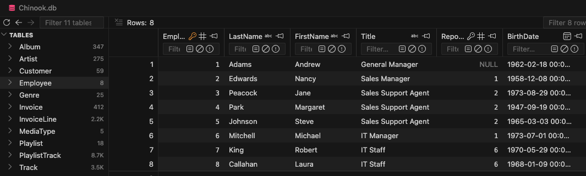

## Agentic Workflow

[Workflow Composition using LangGraph](https://github.com/aws-samples/aws-ai-ml-workshop-kr/tree/master/genai/aws-gen-ai-kr/20_applications/12_advanced_agentic_text2sql#lab-2-workflow-composition-using-langgraph)와 같이 Graph를 이용해 agent를 이용해 좀더 복잡한 경우에도 효과적으로 query문을 생성할 수 있습니다.

이때의 세부동작은 아래와 같습니다.

## Chinook Sample

여기에서는 [Chinook](https://github.com/lerocha/chinook-database/blob/master/README.md)을 활용합니다. 상세한 내용은 [chinook-database.md](./chinook-database.md)을 참조합니다.

## 실행 결과

아래와 같이 "Text2SQL Agent"을 선택합니다.

"Track 테이블의 전체 재생 시간"을 입력하면 기존 검색이므로 아래와 같은 답변을 얻을 수 있습니다.

이후 "테이블의 전체 레코드 수 조회"하면, 유사한 schema를 활용하여 아래와 같은 검색을 수행합니다.

최종 결과는 아래와 같습니다.

"크리스마스에 듣기 좋은 음악 리스트는?"와 같은 질문을 하면 기존 query에 없으므로 아래와 같이 schema 정보를 이용해 query문을 생성합니다.

